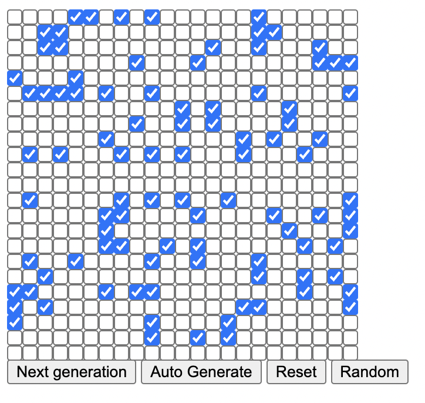

# Conway's Game of Life

Conway’s Game of Life is a simple simulation game (cellular automaton if you want to be fancy) that simulates artifical life on a grid composed of cells. Each cell has two states: dead or alive. 

Each generation of the simulation, the grid is updated using the following rules:

Any living cell with fewer than two or more than three living neighbors dies.

Any living cell with two or three living neighbors lives on to survive to the next generation.

Any dead cell with exactly three living neighbors becomes a living cell.

A neighbor is defined as any cell next to the cell in question, including cells that are diagonally adjacent.

These rules are applied to the whole grid at once, not one cell at a time. So changes that occur to a cell when calculating the next generation should not be taken into account when evaluating the state of other cells in the same generation.
